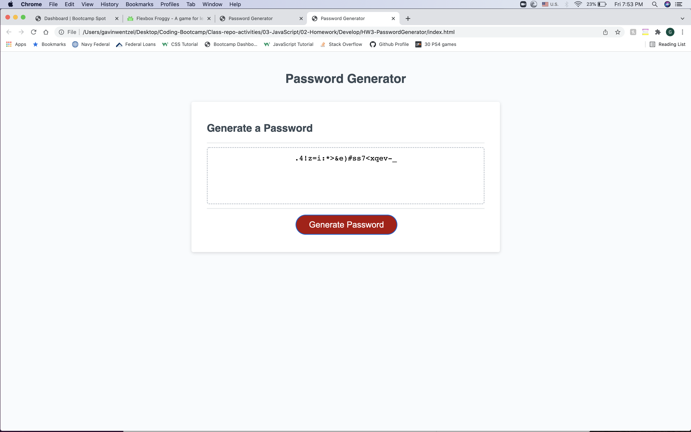

# <HW3-PasswordGenerator>
​
## Description
​
I wanted to create a secure password generator that would create a password randomly given the following criteria:
password length, inclusion of lowercase letters, inclusion of uppercase letters, inclusion of numeric characters, and inclusion of special characters.  This secure password would have to be between 8 and 128 characters and would obviously have to include at least one of the aforementioned character types.

I learned an awful lot from this project.  I learned the significance between local and global variables, how to concat arrays together, and how to pull data randomly from an array to add to a new variable.

    ```md
    ;
    ```
​Links:
github repo url: "https://github.com/gwentzel26/HW3-PasswordGenerator";
Deployed application url: "https://gwentzel26.github.io/HW3-PasswordGenerator/";
